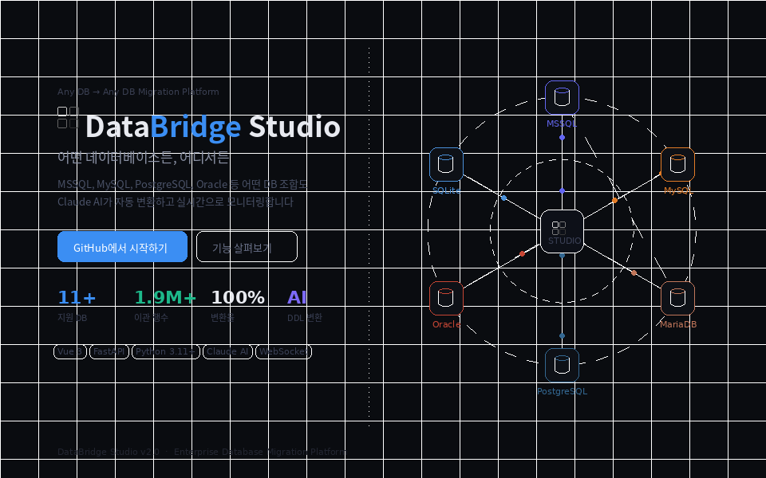

<div align="center">

<br/>



<br/><br/>

# DataBridge Studio

**Enterprise Database Migration Platform**

어떤 데이터베이스든 — AI가 자동으로 변환하고, 안전하게 이관합니다

<br/>

[](https://python.org)
[](https://vuejs.org)
[](https://fastapi.tiangolo.com)
[](https://anthropic.com)
[](LICENSE)

</div>

<br/>

---

## 지원 데이터베이스

```
  MSSQL ──┐                    ┌── MySQL
  Oracle ──┤                   ├── MariaDB
PostgreSQL ──┤  DataBridge  ├── PostgreSQL
    MySQL ──┤    Studio    ├── Oracle
  SQLite ──┤                   ├── SQLite
  MariaDB ──┘                    └── + More
```

**소스 → 타겟 어떤 조합이든 지원합니다** (11개 DB 종류)

<br/>

---

## 주요 화면

| 화면 | 설명 |
|------|------|
| 🏠 **랜딩 페이지** | DB 노드 애니메이션, 시작하기 |
| 📊 **대시보드** | 전체 이관 현황 한눈에 보기 |
| 🧙 **이관 위저드** | 5단계 직관적 이관 설정 |
| 📡 **실시간 모니터** | 테이블·오브젝트별 진행 상황 |
| 🗂 **스키마 탐색기** | DB 구조 시각화 및 비교 |
| ✅ **쿼리 검증** | 이관 전후 데이터 정합성 검증 |
| 🤖 **AI 어시스턴트** | DDL 변환 · SQL 최적화 |
| ⏰ **스케줄 관리** | 자동 이관 일정 관리 |

<br/>

---

## 핵심 기능

### 🤖 AI DDL 자동 변환
Claude AI가 트리거, 저장 프로시저, 함수, 뷰의 DB 방언 차이를 자동 변환합니다.

- MSSQL의 `INSERTED`/`DELETED` → MySQL `NEW`/`OLD`
- `NEWID()` → `UUID()`, `GETDATE()` → `NOW()`
- 다중 이벤트 트리거 자동 분리 (`AFTER INSERT, UPDATE, DELETE` → 3개 트리거)
- MSSQL 잔류 패턴 감지 시 자동 AI 재변환

### 📡 실시간 이관 모니터링

```
① FK · 트리거 비활성화   →  ② 데이터 이관  →  ③ 오브젝트 이관  →  ④ FK · 트리거 복원
```

- 테이블별 진행률, 처리 행수, 소요 시간 실시간 표시
- 오류 발생 시 자동 재이관 및 건별 재시도
- WebSocket 기반 실시간 업데이트

### 🧙 5단계 이관 위저드

```
1단계  DB 선택      소스/타겟 연결 정보 입력 및 연결 테스트
2단계  객체 선택    이관할 테이블 · SP · 함수 · 트리거 · 뷰 선택
3단계  변환 규칙    NOT NULL 위반, 타입 차이 등 정규화 분석
4단계  실행 옵션    배치 크기 · 변환 엔진 (Claude AI / 규칙 기반) 설정
5단계  검토 & 실행  최종 확인 후 이관 시작
```

### 🛡 안전한 이관 보장

- **트리거 비활성화** — 이관 중 트리거 자동 DROP → 완료 후 자동 복원
- **FK 의존성 정렬** — Kahn's 알고리즘으로 부모 → 자식 테이블 순서 자동 결정
- **INSERT IGNORE** — 중복 PK 자동 스킵
- **NULL_VIOLATION 감지** — NOT NULL 컬럼의 NULL 데이터 사전 감지 및 자동 수정

<br/>

---

## 기술 스택

| 구분 | 기술 |
|------|------|
| **Frontend** | Vue 3, Vite, Pinia, WebSocket |
| **Backend** | FastAPI, Python 3.11+ |
| **DB 연결** | PyMySQL, PyODBC, psycopg2, cx_Oracle |
| **AI 엔진** | Claude AI (Anthropic) |
| **데이터** | JSON Store (설정·이력) |

<br/>

---

## 빠른 시작

### 사전 요구사항

- Python 3.11+
- Node.js 18+
- Claude API 키 ([console.anthropic.com](https://console.anthropic.com) 에서 발급)

### 설치 및 실행

```bash
# 1. 저장소 클론
git clone https://github.com/mano2126/databridge.git
cd databridge

# 2. 백엔드 설치 및 실행
cd backend
pip install -r requirements.txt
uvicorn app.main:app --host 0.0.0.0 --port 8000 --reload

# 3. 프론트엔드 설치 및 실행 (새 터미널)
cd frontend
npm install
npm run dev
```

브라우저에서 `http://localhost:5173` 접속

### Claude API 키 설정

1. 우측 상단 ⚙ **시스템 설정** 클릭
2. **Anthropic API 설정** → API 키 입력 → **저장**
3. **API 연결 테스트** 클릭하여 연결 확인

<br/>

---

## 프로젝트 구조

```
databridge/
├── backend/
│   ├── app/
│   │   ├── api/routes/
│   │   │   ├── jobs.py          # 핵심 이관 엔진
│   │   │   ├── schema.py        # DDL 변환 · AI 연동
│   │   │   ├── connector.py     # DB 연결 관리
│   │   │   ├── validate.py      # 쿼리 검증
│   │   │   ├── settings.py      # 시스템 설정
│   │   │   └── ...
│   │   ├── core/
│   │   ├── scheduler/
│   │   └── main.py
│   └── requirements.txt
│
└── frontend/
    └── src/
        └── pages/
            ├── Landing.vue          # 랜딩 페이지 (DB 애니메이션)
            ├── Dashboard.vue        # 대시보드
            ├── JobWizard.vue        # 이관 위저드
            ├── JobMonitor.vue       # 실시간 모니터
            ├── JobList.vue          # 이관 작업 목록
            ├── Schema.vue           # 스키마 탐색기
            ├── SchemaDeps.vue       # 의존성 맵
            ├── SqlVerify.vue        # 쿼리 검증
            ├── AiAssistant.vue      # AI 어시스턴트
            ├── Settings.vue         # 시스템 설정
            ├── Connector.vue        # 커넥터 관리
            ├── Schedule.vue         # 스케줄 이관
            └── ...
```

<br/>

---

## 라이선스

MIT License — 자유롭게 사용, 수정, 배포하실 수 있습니다.

<br/>

---

<div align="center">

Built with ❤️ by **mano2126** · Powered by **Claude AI**

[⭐ Star](https://github.com/mano2126/databridge) · [🐛 Issues](https://github.com/mano2126/databridge/issues) · [📖 Wiki](https://github.com/mano2126/databridge/wiki)

</div>
